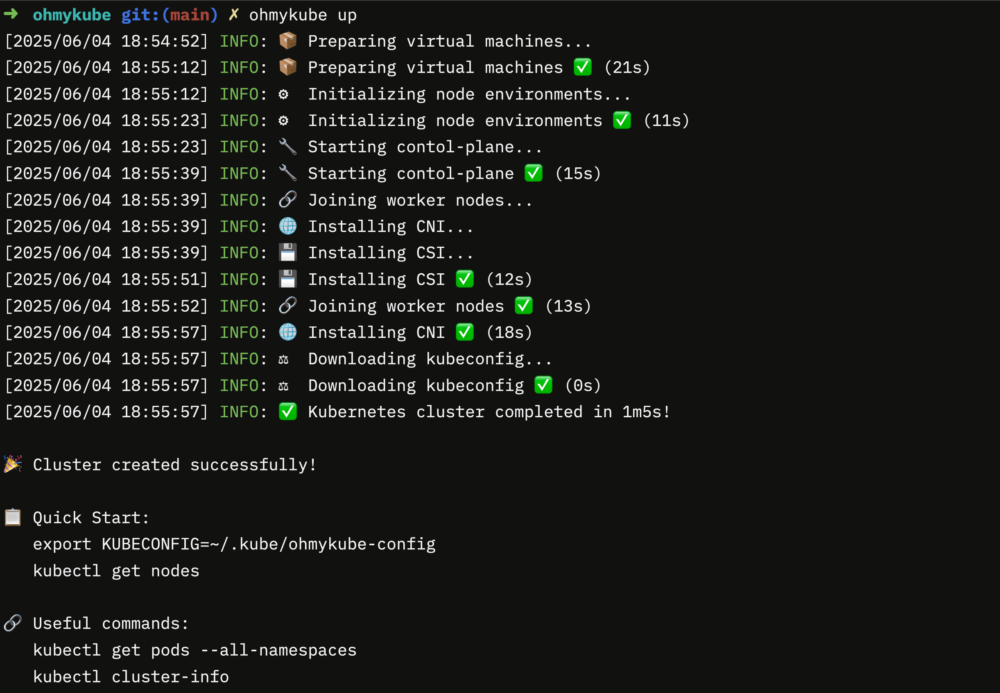

# Oh My Kube：搞定K8S，就是简单，就是快！

<p align="center">
  <strong>在多节点或异构虚拟机上快速启动完整的本地 Kubernetes 集群</strong>
</p>

<p align="center">
  中文文档 | <a href="README.md">English</a>
</p>

<p align="center">
  <a href="#快速开始">快速开始</a> •
  <a href="#使用场景">使用场景</a> •
  <a href="#kubernetes-版本支持">Kubernetes 版本支持</a> •
  <a href="#发展路线图">发展路线图</a>
</p>

## 快速开始

### 前置要求

1. 安装 [Lima](https://github.com/lima-vm/lima)
2. 安装 Go 1.23.0 或更高版本

### 安装

```bash
# 克隆仓库
git clone https://github.com/monshunter/ohmykube.git
cd ohmykube

# 编译并安装
make install
```

### 基本使用

```bash
# 创建集群（默认：1 个主节点 + 2 个工作节点）
ohmykube up

# 查看集群状态
export KUBECONFIG=~/.kube/ohmykube-config
kubectl get nodes

# 删除集群
ohmykube down
```



### 创建自定义集群

```bash
# 自定义节点数量和资源
ohmykube up --workers 3 --master-cpu 4 --master-memory 8 --master-disk 20 \
            --worker-cpu 2 --worker-memory 4096 --worker-disk 10

# 选择网络插件
ohmykube up --cni cilium

# 选择存储插件
ohmykube up --csi rook-ceph

# 启用 LoadBalancer
ohmykube up --lb "metallb"

```

### 集群管理

```bash
# 列出所有节点
ohmykube list

# 添加节点
ohmykube add --cpu 2 --memory 4 --disk 20

# 删除节点
ohmykube delete ohmykube-worker-2

# 强制删除（不先驱逐 Pod）
ohmykube delete ohmykube-worker-2 --force

# 启动节点
ohmykube start ohmykube-worker-2

# 停止节点
ohmykube stop ohmykube-worker-2

# 进入节点 Shell
ohmykube shell ohmykube-worker-2

```

### 自定义 Kubeadm 配置(未支持，开发中)

您可以提供自定义的 kubeadm 配置文件来覆盖默认设置。支持以下部分：

- InitConfiguration
- ClusterConfiguration
- KubeletConfiguration
- KubeProxyConfiguration

示例：

```yaml
apiVersion: kubeadm.k8s.io/v1beta4
kind: InitConfiguration
nodeRegistration:
  criSocket: unix:///var/run/containerd/containerd.sock
---
apiVersion: kubeadm.k8s.io/v1beta4
kind: ClusterConfiguration
kubernetesVersion: v1.33.0
networking:
  podSubnet: 192.168.0.0/16
  serviceSubnet: 10.96.0.0/12
```

## 使用场景

- **开发和测试**：在类似生产环境中测试应用程序
- **学习 Kubernetes**：了解真实 Kubernetes 集群的工作原理
- **本地 CI/CD**：在本地构建完整的集成测试环境
- **网络和存储研究**：测试不同的 CNI 和 CSI 组合
- **集群管理实践**：学习节点管理、维护和故障排除

## 发展路线图

我们正在规划以下功能增强：

### 近期计划 🚀

- **多集群管理**
  - 项目初始化（`ohmykube init`）
  - 集群切换（`ohmykube switch`）

### 中期计划 🔄

- **提供商抽象**
  - 支持云 API 虚拟机创建（阿里云、腾讯云、 AWS、GKE 等）
  - 支持更多本地虚拟化平台

### 长期愿景 🌈

- **插件生态系统**
  - 插件扩展机制
  - 常用插件集成（监控、日志、CI/CD 等）

- **开发者工具**
  - IDE 集成
  - 调试工具链
  - 开发工作流优化

## 支持的平台

- Mac arm64（已支持）
- Linux arm64/amd64 (未支持)
- 其他平台（未支持）

## Kubernetes 版本支持

✅ **支持 Kubernetes v1.24.x 及以上版本**

## 贡献

我们欢迎各种形式的贡献，无论是代码、文档还是想法：

- 提交 Issues 报告错误或请求功能
- 提交 Pull Requests 贡献代码或文档
- 参与讨论并分享您的经验
- 帮助测试新功能和版本

## 许可证

MIT
